# docker的安装&使用

### 安装docker

##### 1. 首先，更新apt包的索引：

```bash
$ sudo apt-get update
```

##### 2. 安装相关的依赖包，使得apt可以通过HTTPS使用repository：

```bash
$ sudo apt-get install -y apt-transport-https ca-certificates curl software-properties-common
```

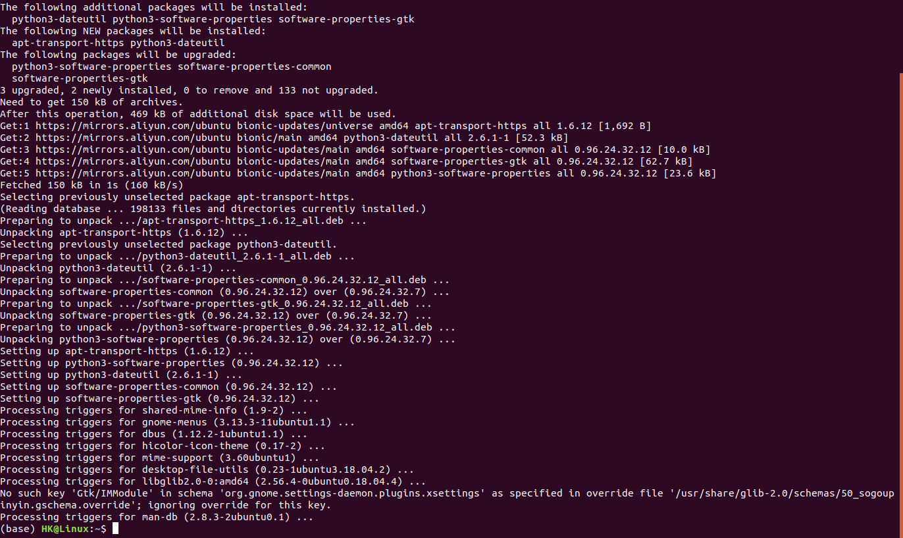

##### 3. 添加Docker官方的GPG密钥：

```bash
$ curl -fsSL https://download.docker.com/linux/ubuntu/gpg | sudo apt-key add -
```

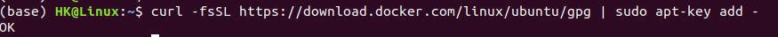

显示添加成功。

##### 4. 添加下载docker的stable存储库：

```bash
$ sudo add-apt-repository "deb [arch=amd64] https://download.docker.com/linux/ubuntu $(lsb_release -cs) stable"
```

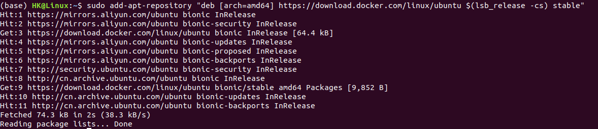

##### 5. 再次更新apt包索引：

```bash
$ sudo apt-get update
```

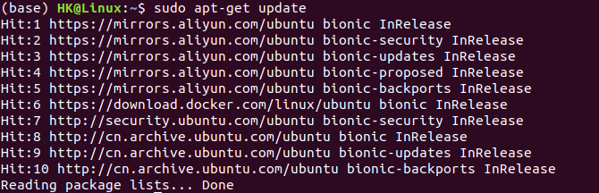

##### 6. 安装最新版本的Docker CE

因为我们的用途主要是个人开发，因此安装社区版（CE）即可。

```bash
$ sudo apt-get install -y docker-ce
```

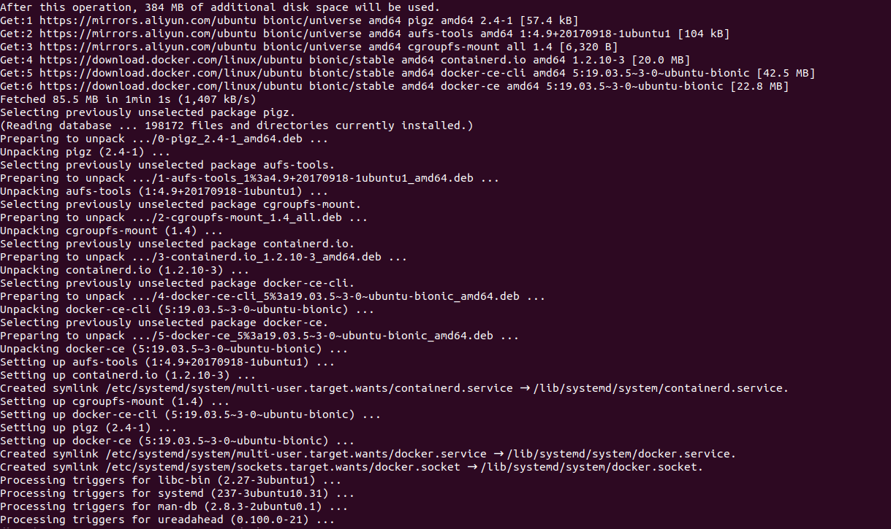

输入安装命令后，输出以上信息。接下来，验证docker是否安装成功。

##### 7. 查看docker服务是否启动：

```bash
$ systemctl status docker
```

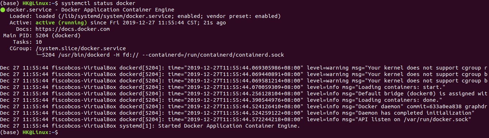

输出以上语句，表明docker服务已经成功启动，现在我们可以开始使用docker了。


### 使用docker

##### 1. 检查docker的版本：

```bash
$ docker version
```

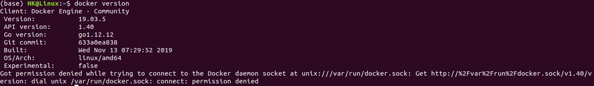

输出以上语句，提示没有权限连接到unix socket，使用管理员权限运行该命令：

```bash
$ sudo docker version
```

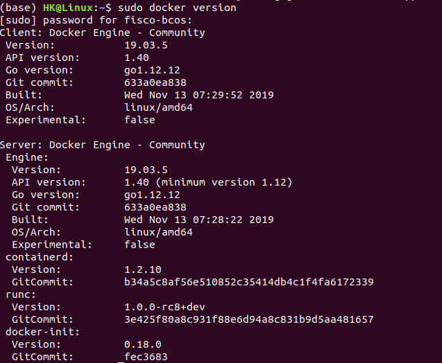

可以看到，docker正常运行。

##### 2. 运行hello-world镜像：

```bash
$ sudo docker run hello-world
```

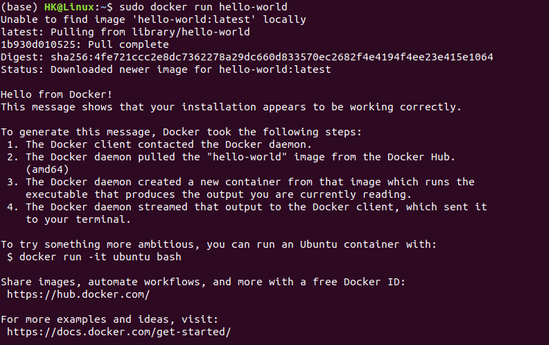

可以看到，hello-world运行成功。

##### 3. 检查本地镜像库内容：

```bash
$ sudo docker images
```

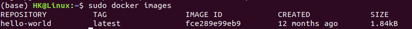

##### 4. 显示运行中容器

```bash
$ sudo docker ps
```


因为hello-world已经运行完了，因此没有容器正在运行。

##### 5. 显示所有容器，包括已停止：

```bash
$ sudo docker ps -a
```

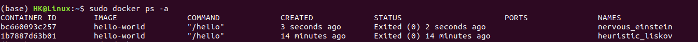

刚刚运行了两次hello-world，因此这里有两个hello-world的容器。

##### 6. 停止容器

首先我们运行ubuntu的镜像：

```bash
$ sudo docker run -i -t ubuntu /bin/bash
```

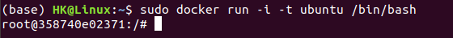

进入交互式界面后，在另一终端输入

```bash
$ sudo docker ps
```

可以看到ubuntu容器正在运行：

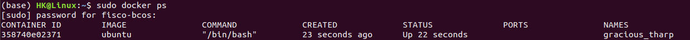

输入`exit`停止容器：

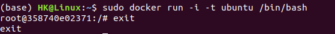

##### 7. 重启容器

从上一步我们得知ubuntu容器的id为358740e02371，因此我们可以使用此id重启ubuntu容器。

```bash
$ docker restart 358740e02371
```

重启容器后，通过

```bash
$ sudo docker ps
```

检查其运行情况并通过

```bash
$ sudo docker attach 358740e02371
```

重新进入容器：


##### 8. 容器化MySQL

首先，拉取MySQL镜像：

```bash
$ sudo docker pull mysql:5.7
```

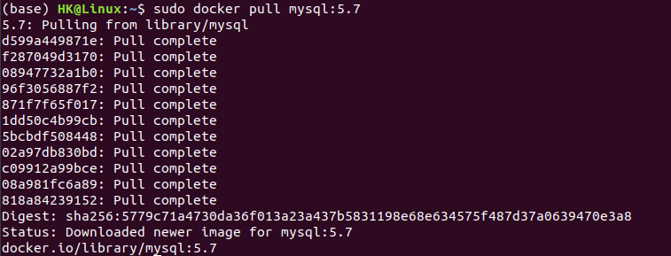

该过程耗时较久，需要耐性等待。

然后，创建MySQL容器构建文件dockerfile，dockerfile内容如下：

```bash
FROM ubuntu
ENTRYPOINT ["top", "-b"]
CMD ["-c"]
```

然后在dockerfile所在的目录构建镜像，名为hello：

```bash
$ sudo docker build . -t hello
```

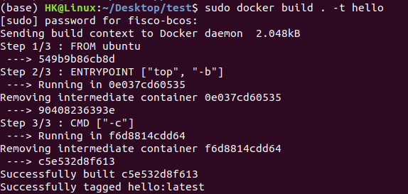

可以看到，镜像已经成功生成。运行容器：

```bash
$ sudo docker run -it --rm hello -H  
```

成功运行后，终端会一直输出相关的信息：


然后便可以运行MySQL服务器：

```bash
sudo docker run -p 3306:3306 --name mysql2 -e MYSQL_ROOT_PASSWORD=root -d mysql:5.7 
```

再运行MySQL客户端：

```bash
$ sudo docker run -it --net host mysql:5.7 "sh"
$ mysql -h127.0.0.1 -P3306 -uroot -proot
```

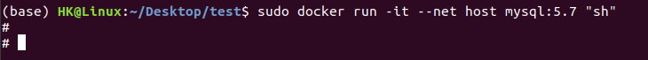

一开始启动mysql的时候遇到了问题：


经过网上查找办法后，在我的`/etc/mysql/mariadb.conf.d/50-server.cnf`文件的`[mysqld]`字段下增加了`skip-grant-tables`字段，然后便可以正常登录mySQL：

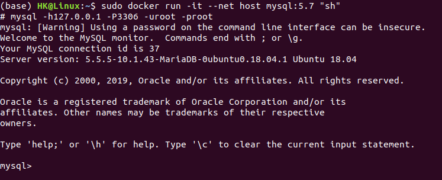

